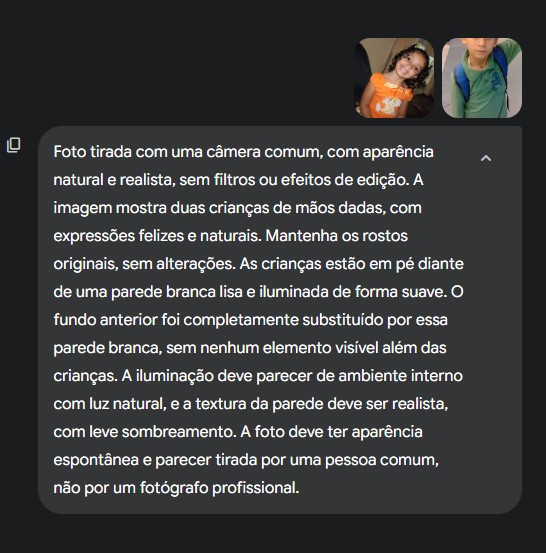
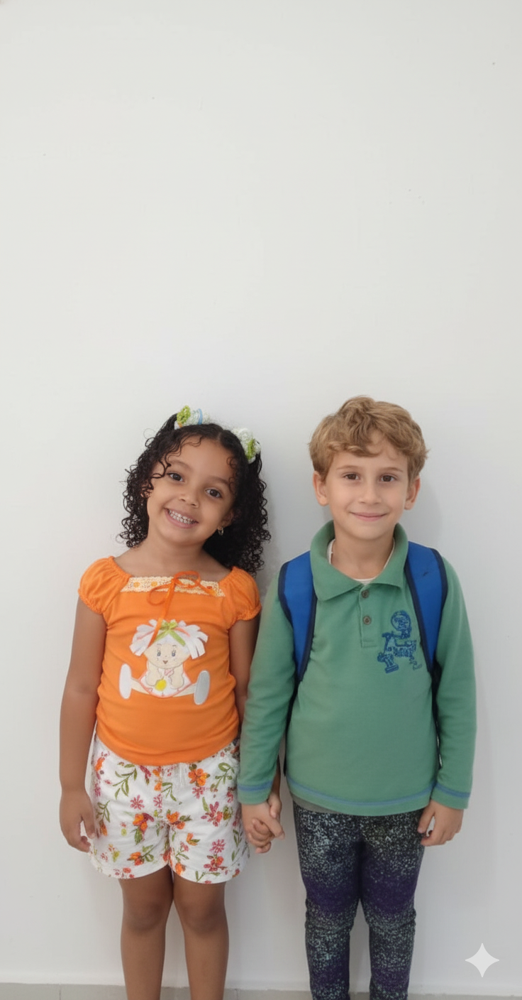

# Criação de imagens realistas com Gemini 

## 📒 Descrição
Este projeto teve como objetivo criar uma imagem realista e natural utilizando inteligência artificial. A proposta foi gerar uma fotografia que parecesse ter sido tirada por uma câmera comum, retratando duas crianças de mãos dadas, de forma espontânea e com aparência autêntica. O foco principal foi preservar a naturalidade e a emoção do momento, evitando qualquer aspecto artificial ou de estúdio.

## 🤖 Tecnologias Utilizadas
Gemini (Google AI)

## 🧐 Processo de Criação
O processo começou com a elaboração de um prompt detalhado, cuidadosamente escrito para guiar a IA na criação de uma imagem o mais realista possível. O prompt utilizado foi o seguinte:

"Foto tirada com uma câmera comum, com aparência natural e realista, sem filtros ou efeitos de edição. A imagem mostra duas crianças de mãos dadas, com expressões felizes e naturais. Mantenha os rostos e sorrisos originais, sem alterações. As crianças estão em pé diante de uma parede branca lisa e iluminada de forma suave. O fundo anterior foi completamente substituído por essa parede branca, sem nenhum elemento visível além das crianças. A iluminação deve parecer de ambiente interno com luz natural, e a textura da parede deve ser realista, com leve sombreamento. A foto deve ter aparência espontânea e parecer tirada por uma pessoa comum, não por um fotógrafo profissional."

Após definir o prompt, o texto foi inserido no Gemini, que processou as instruções e gerou a imagem conforme a descrição. Foram feitos pequenos ajustes na formulação do texto para alcançar o equilíbrio certo entre realismo e naturalidade, garantindo que o resultado final mantivesse o estilo “aesthetic” desejado.

## 🚀 Resultados
O resultado foi uma imagem extremamente realista, que transmite leveza e espontaneidade. As crianças aparecem com expressões naturais, a iluminação é suave e o cenário mantém a simplicidade e autenticidade de uma foto cotidiana. O projeto cumpriu seu propósito de criar algo “natty” ou seja, com aparência genuína, sem exageros de edição.

## 💭 Reflexão (Opcional)
Criar algo natural usando IA é um desafio interessante. Exige atenção aos detalhes do prompt e um bom equilíbrio entre descrição técnica e sensibilidade estética. Trabalhar com o Gemini foi uma ótima experiência para entender como a inteligência artificial pode gerar imagens realistas quando guiada com clareza e propósito.
